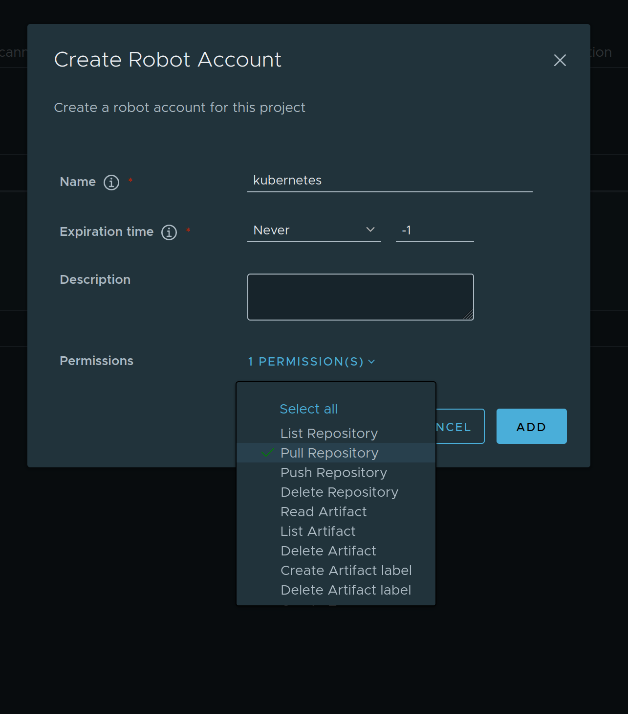

# kubernetes-principles-webinar-series

Detta repo har kod som komplement till webbinarieserien skapad av Elastisys och Safespring gällande "Design och driftsättning av skalbara applikationer på Kubernetes". 
Se hela webbinarieserien på följande adress:

Vi förutsätter att dessa instruktioner följs på Compliant Kubernetes, men det går att hänga med även med andra Kubernetes-distributioner.

## Förberedelser

### Variablen `$DOMAIN`

Vi utgår i följande förberedelser från att det finns en variabel i ditt shell som heter `DOMAIN`, som brukligt är för Elastisys Compliant Kubernetes.
Se till att den är satt så som din administratör gav den till dig.

### Harbor: skapa projekt och robot account för nginx-unprivileged

Logga in i din Harbor via `harbor.$DOMAIN`

Skapa ett nytt projekt, kalla det för `nginx-unprivileged`.

Gå sedan till dess Robot Accounts-del och skapa ett Robot Account som du ger namnet `kubernetes`.
Rutan bör se ut så här:



När du får frågan, ladda hem filen med Robot Account:ets användarnamn och lösenord.
Spara den som `robot-account.json` i valfri mapp.

### Pull Secret

Vi ska nu skapa en "image pull secret" för ditt Harbor-projekt genom att skriva kommandon nedan.
Vi antar att du har verktyget [jq](https://jqlang.github.io/jq/) installerat och då är kommandona enkla enligt nedan:

```sh
DOCKER_USER=$(jq -r .name robot-account.json)
DOCKER_PASSWORD=$(jq -r .secret robot-account.json)

kubectl create secret docker-registry pull-secret-principles \
    --docker-server=harbor.$DOMAIN \
    --docker-username=$DOCKER_USER \
    --docker-password=$DOCKER_PASSWORD
```

### Spegla container image för nginx-unprivileged

Nu skall vi ladda upp `nginx-unprivileged` till ditt Harbor.
Ladda först hem det till egna datorn, tagga om det för din Harbor och ladda slutligen upp container imagen:

```sh
docker pull nginxinc/nginx-unprivileged:mainline-perl
docker tag nginxinc/nginx-unprivileged:mainline-perl harbor.$DOMAIN/nginx-unprivileged/nginx-unprivileged:mainline-perl
docker push harbor.$DOMAIN/nginx-unprivileged/nginx-unprivileged:mainline-perl
```

Verifiera gärna i din Harbor att din image har kommit dit.

# Dags att börja!

Med förberedelserna klara är du redo att gå in i den katalog som intresserar dig mest och prova exemplen.
Välj själv:

- [configmap-vs-secret](configmap-vs-secret)
- [pod-topology-spread-constraints](pod-topology-spread-constraints)
- [horizontal-pod-autoscaler](horizontal-pod-autoscaler)